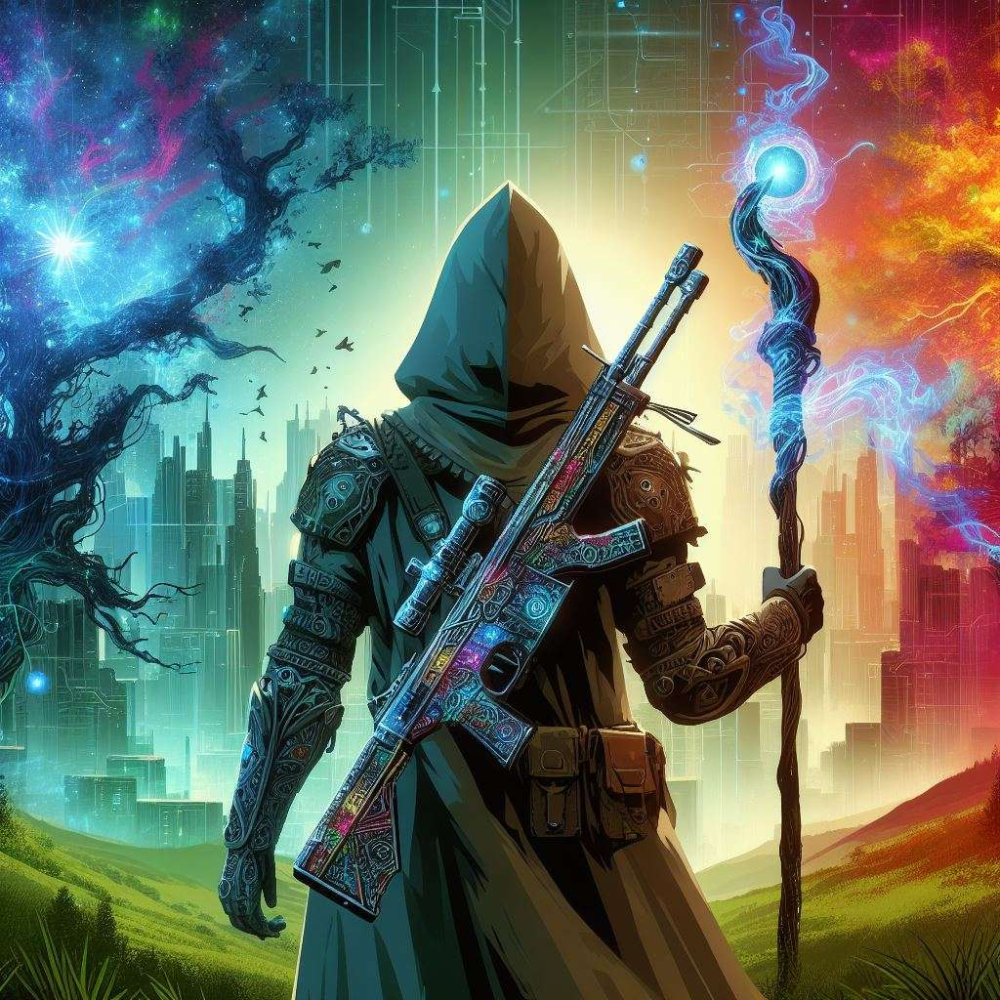

# Incursion

## Incursion: A Choose Your Own Adventure

You have been bestowed the gift of thaumaturgy in a world similar but different to the one you know.

You can read about the new world and your new power under Setting. After that are four sections, in each you have a separate pool of points or set of choices.

In Foundations, spend Foundation points to increase your Thaumaturgic Power and Endurance and purchase the Sources and Methods you use to access power and cast magic.

In Talents, spend Talent points to enhance your repertoire of spells.

In Bonds, assign Bond points to gain magical Items, make special Contacts, befriend powerful Allies, and forge supernatural Pacts.

Finally, you will have the chance to choose zero to two Threats. Each one places you in the path of some grave risk to the world, but also grants you unique benefits to fight it, and rewards should you overcome.

Once finished, you can export your character and share your choices in a forum such as [Reddit](https://www.reddit.com/r/makeyourchoice).