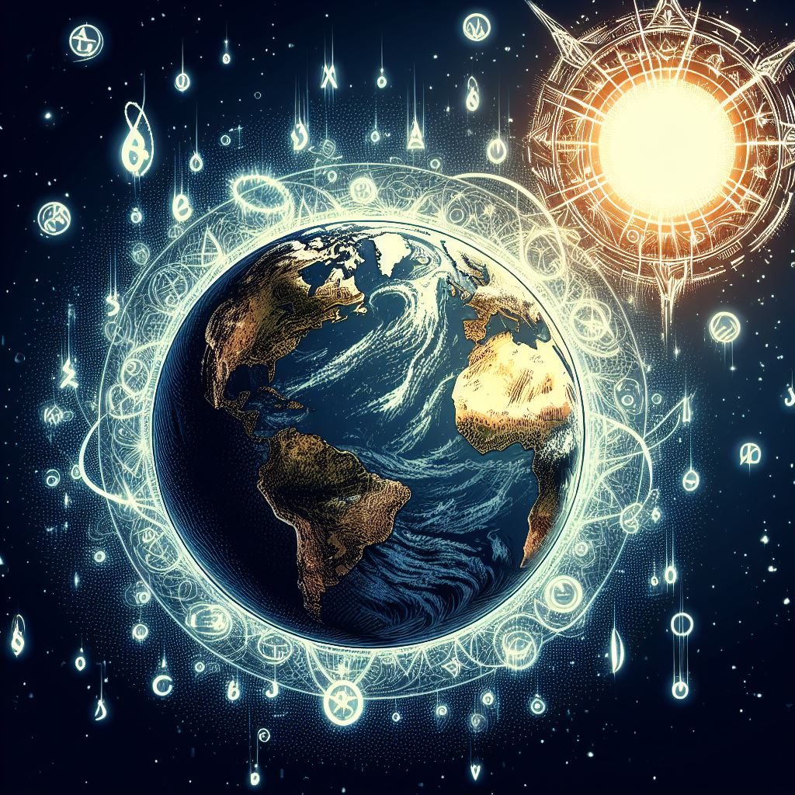
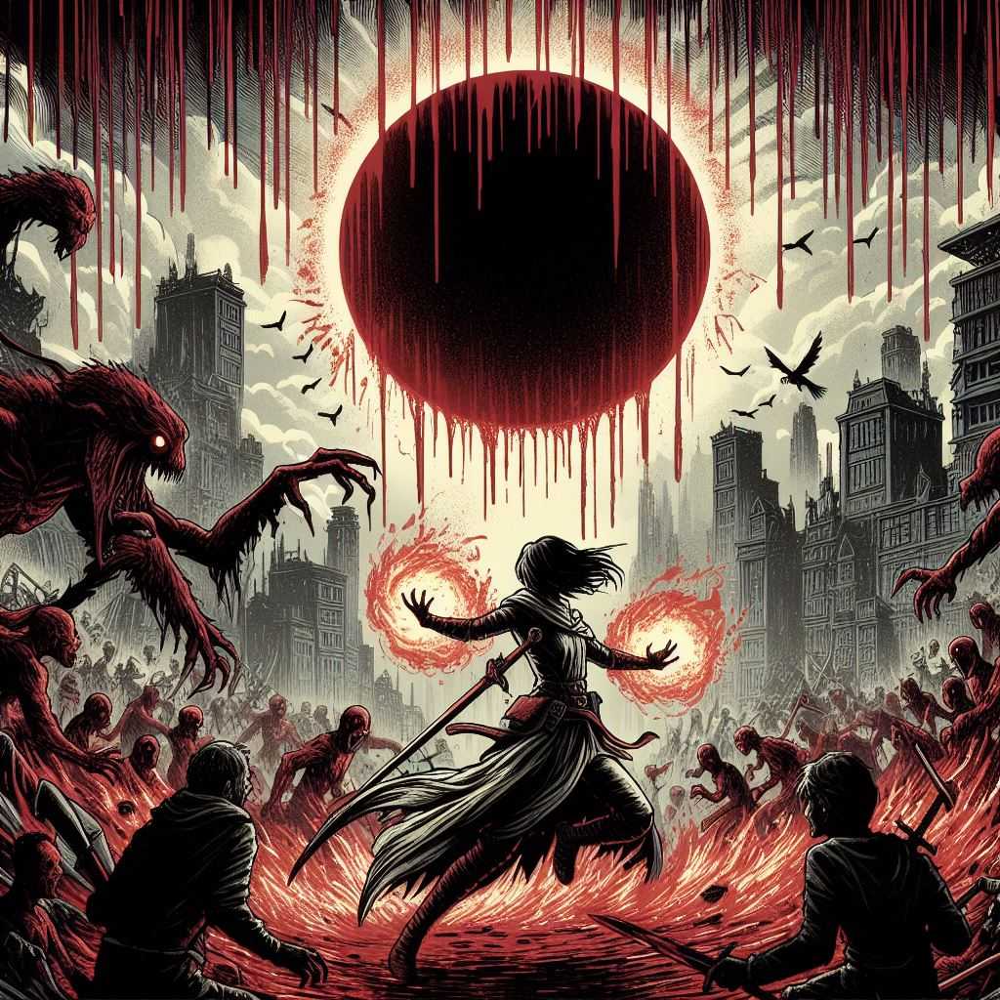

# Setting

## Setting

The world has changed.

It may look similar: great monuments still stand, cities light up the night, and people live and love and hate as they always have. Some even manage to live in denial that the world of their memories and the world they live in don't seem to match at the edges anymore.

The Incursion. A disruption so fundamental we cannot even say for sure when it happened, as it disturbed the flow of time itself. Unsteady rumors and strange science have pieced together a picture: another world--a parallel dimension or something harder to imagine--shattered, and its unfathomable wreckage is colliding with our own.

Strange things stalk the dark and wild places of the world. Fragments of knowledge and tattered remnants of memories cling to people, giving them glimpses of a world clearly not our own. Relics of inhuman design are unearthed beneath stone and soil, hidden in ways that should not have been possible. And above all, everyone knows someone--someone ordinary, a neighbor or a friend--who can now reshape reality with a gesture and a word: thaumaturges.

Are you ready to join their ranks?

### Thaumaturgy

Those who practice thaumaturgy come in a breadth of types and abilities, but every one of them draws up the mysterious essence we call "aether" and shapes it into the miraculous, into the impossible: into magic.

About 1 in 50 humans has the potential for any thaumaturgy at all; about 1 in 4 of those (1 in 200 humans) has enough ability to practice it professionally. And 1 in 1000 of those thaumaturges (1 in 200,000 humans) are a special kind of thaumaturge: a true mage. Which is what you have become.

Thaumaturgy can be broken down into parts, called Aspects, that every thaumaturge possesses:

- A conduit: the piece of your soul that draws aether.
- One or more Sources: the ways you(r conduit) acquires aether.
- One or more Methods: how you shape aether into magical effects.
- Talents: abilities that allow you to cast specific types of more powerful magical effects.

### Conduits (Power, Capacity, and Tax)

Your conduit is what you use to draw aether.

It is rated by Power and Capacity, which are, respectively, how much aether you can draw at once, and how often you can draw.

"Tax" can occur when you use your conduit. It reduces your effective Power. Tax is usually described as a percentage: 100% Tax means you can't use thaumaturgy at all.

Light and infrequent magical activity won't cause Tax, and a small amount might even be considered healthy, like being tired or sore from exercise. Performing many small castings rapidly, or any castings near your max Power are more likely to Tax you.

You recover tax by not drawing aether. On *average* you recover Capacity percentage points per hour, but more of this is while actively resting, meditating, or sleeping; it's slower if you're stressed or deprived (eg, of food or rest).

If you go above 100% (eg, by trying for a max strength draw at 98% Tax), your conduit becomes over-Taxed. This is painful, and you won't be able to draw any aether until it *completely* recovers. Repeatedly over-Taxing your conduit can lead to injury, permanently reducing your Power and Capacity.

Either high Power or high Capacity will let you make low-circe draws pretty much continuously. However, high Power with low Capacity means that any non-trivial casting will tax you immediately; though you can every now and then cast a spell that hits like a meteor, last months, or covers tens of square miles. Meanwhile, high Capacity but low Power would let you cast moderate spells constantly without issue, but leave you unable to exceed that in any circumstances. Choose carefully.

### Sources

Sources describe where and how your conduit draws aether. Aether is aether, no matter how you get it. But Sources differ in how easy it is to draw in different circumstances, or what side effects drawing might have; some have special rules for how they tax you. For example: Arcane Font taps energy in the environment, so you can get more or less aether for a given strength of draw depending on where you are; meanwhile, Bonds of Spirit draws energy from a global spiritual web, and you get more or less aether based on how vigorous the web is at that moment.

### Methods

Methods are how you transform aether into a magical effect. Each Method differs in several ways, including:

- What preparations you need: eg, Artificers must have a specific device, Ritualists a prepared space, etc.
- What you need to be able to do (or how an enemy might stop you): Lightweavers need freedom of their hands, Scriveners need the correct talisman on their person.
- How obvious your magical effects will be: Pyromancers make bursts of light and heat, Wizards must speak obviously magic words in a clear voice, but Psychics rarely show any sign.

Just like aether is aether no matter the Source, a magical effect is the same whether it's shaped into being by an Artificer's device or a Wizard's art. Though each Method does have categories of benefits and drawbacks: types of effect that are easier or harder to generate.

Your skill with a Method, sometimes called "aether control", determines how well you can control and mold aether. Aether control is not a natural skill for humans, so everyone starts out clumsy, and stays that way for a long time; but diligent effort yields results, and there's a very high skill ceiling. Each Method varies in what type of person does best with it, and what kind of effort best improves your ability. The better you can control aether, the more your magical effects will reflect your intentions, and the less aether is wasted.

Castings vary widely in the amount of time to shape them, based on both the type of effect and the Method used. Going faster, such as in an emergency situation, requires you to waste large amounts of aether (so requiring a larger draw for the same effect strength, up to twice as much) and increases the risk the effect failing or going haywire.

Some effects are complex enough (eg, creating new organs with Old Flesh, advanced Aspectcrafting, casting powerful wyrds with Sortition) that only the truly adept with a Method can even attempt them with any hope of success.

### Castings

Thaumaturgic castings come in two levels: "tricks" and "spells". Tricks are weaker, and must be learned and practiced, but every thaumaturge can perform most types of trick. Spells are more powerful and intuitive, but restricted to the appropriate Talent.

Tricks:

- Tricks are an extension of a Method, and must be learned and practiced per Method (eg, practice to generate illumination effects as a Wizard is different from practicing them as a Psychic.)
- The knowledge and practice underlying a trick are very narrow: eg, generating a stationary beam of light is a completely different trick from generating a ball of light that moves; boosting the immune system against viruses is a different than boosting it against parasites, etc.
- Every thaumaturge can theoretically perform nearly any type of trick.
- Aether control is reduced with tricks; they are less reliable, slower to cast, and require more aether than a spell for a given effect.
- No matter how skilled you are a trick falls apart with too much Aether is put into it, limiting its maximum magnitude and endurance.
- Cannot create long term magical effects (cf reservation).
- Tricks are fairly limited at some areas of magical effect:
    - Transformation of living things.
    - The spiritual: at most can give mild protection and very basic knowledge effects.

Spells

- The thaumaturge can intuitively create any effect covered by their version of their Talent.
- It is possible to cast spells with effects that no trick can imitate.
- Your control is limited only by your skill with your Method.
- The amount of Aether is limited to what you can provide.
- Even when doing what a trick can, and using the same amount of aether, a spell is more powerful.
- See the list of Talents for specifics.

NB: tricks are only *relatively* weaker. Most thaumaturges can learn attack tricks at least as effective as a hand gun, and defensive tricks more effective than modern body armor (on top of being invisible and weightless). This goes without mentioning simple divinations like dowsing, locating missing objects or people, or detecting nearby magic; telekinesis tricks with more horsepower than human muscle; and movement tricks that, eg, let them burrow through dirt or hit 30mph running; and others. They may require you to find someone willing to teach them, and then a few dozen hours of learning each, and dozens more to make reliable and flexible, but never discount their power.

### Casting

Every casting is a unique construction dependent on your specific circumstances and requirements; that is, they do not come off some established list, and are not done by rote. For example, you don't learn a "light" trick, you learn a variety of aether manipulations that produce light, in different circumstances, styles, strengths, durations, etc.

A single casting can combine effects from multiple Talents (eg, using Call of the Deep and Fell Hand to adopt an underwater war form; or Steel Step and Dark Smoke to craft metal objects; Perspective and a light trick to have a clairvoyant sensor with a source of light; etc).

Many types of magical effects that last more than a moment can be cast so that they’re directed by your will for the duration, or cast to perform some simple action: for example, Dark Smoke can be set to dig a trench for as long as it has power, or Perspective set to circle you continuously at a distance. There are sound tricks to play a simple melody, and ones that work like instruments allowing you to choose what to play. This is chosen at casting time.

The amount of aether you put into an effect determines how strong the effect is, and, if applicable, how long it lasts (whether against time or active efforts to dismantle it). If a magical effect has a duration, you can perform another casting to seamlessly extend it. You can may maintain a ward or transformation more frequently with small aether draws, minimizing tax; or you can use a large draw to make sure the effect continues without distracting you or requiring recasting.

### Reservation

Some of the things you do with magic "reserve" some of your conduit. Reservation works like Tax, reducing your effective Power rating, and reservation and Tax stack. However, you can release a reservation at any point with a simple act of will (the power is coming from you after all) and it immediately recovers.

Reservation mostly occurs from spells that have a continuous effect (such as animating an undead servant, or preparing an alternate form with Skinchanger), but also from the Scrivening Method and in some other situations.

Becoming overtaxed doesn’t stop your reservation supported magic from working.

### True Mages and Other Magical Beings

The Methods, Sources, and Talents described herein are fairly complete versions of each, as True Mages tend to receive. Other thaumaturges are frequently (~60%) restricted to some subset of an Aspect. Most importantly, once they have come into their full thaumaturgy, they can only improve their control and expand their trick repertoire, they will not gain new Aspects. A True Mage is defined by gaining new ones. It is not frequent—typically a dozen or so in a lifetime—but they do gain them.

There are also many inhuman magical lifeforms, on top of supernatural forms of geography, weather, etc. There are non-human thaumaturges, but many creatures have other relationships to magic that do not require drawing and molding to create effects. There may even be a handful of human mutants that have such natural abilities.

Spirits are a broad category of beings and phenomena that seem to exist in a parallel form of existence, intangible and invisible unless they use magic (innate or cast) to affect the world, or a thaumaturge uses magic to perceive and interact with them.

There are even artifacts of the Incursion, inexplicable objects with magical properties unlike what any thaumaturge could craft.

And this is just scratching the surface.